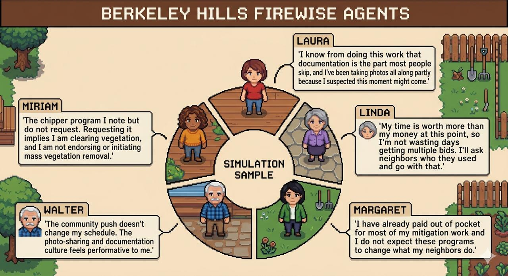

<p align="center">
  
</p>

# Berkeley Hills Wildfire Agent Simulation

A multi-agent simulation of how Berkeley Hills homeowners respond to wildfire mitigation interventions, grounded in real interview transcripts. Built on Park et al.'s (2023) generative agent framework — memory streams, vector retrieval, and two-stage reflection — with empirically derived agent personas replacing fictional seeds.

## Overview

The system takes homeowner interview transcripts and a structured intervention schedule as input, then simulates each homeowner's decisions and reasoning across a 60-day sequence of city ordinances, fire department inspections, neighbor pressure, insurance non-renewals, and resource assistance offers.

LLM-as-judge evaluation scores each agent's behavioral plausibility, persona consistency, and intervention responsiveness across four experimental conditions: full system, no-reflection ablation, no-memory ablation, and a budget model comparison.

## Results

| Condition | Behavioral Plausibility | Persona Consistency | Intervention Responsiveness | Mean |
|---|---|---|---|---|
| Baseline (Sonnet 4.6) | 4.90 | 4.90 | 5.00 | **4.93** |
| No Reflection | 4.80 | 4.90 | 5.00 | 4.90 |
| No Memory or Reflection | 4.80 | 4.80 | 4.80 | 4.80 |
| Budget (Haiku 4.5) | 4.90 | 4.80 | 4.90 | 4.87 |

Full-simulation scores (1–5 scale, Claude Opus judge, temp=0) across 5 agents. Maximum ablation delta: 0.13. The Haiku configuration matched most of the quality benefit at 3× lower cost ($0.26 vs $0.78 per agent).

## Architecture

```
Inputs (agents.yaml, baseline.yaml)
    ↓
Engine (simulation.py, scheduler.py)
    ↓
Environment — channel framing (official mail / news / social / direct experience)
    ↓
Agent Cognition — perceive → retrieve → decide → store → reflect
    ↓
LLM Layer (client.py) — Anthropic SDK + OpenRouter routing
    ↓
Output (JSONL logs) → Evaluation (LLM-as-judge → Excel)
```

**Memory stream** — append-only, typed memories (observation / decision / reflection) with LLM-assigned importance scores and vector embeddings.

**Retrieval** — Park et al. scoring: `score = α·recency + β·importance + γ·relevance`, each normalized to [0,1]. Supports dense (HuggingFace embeddings), sparse (keyword), and hybrid modes.

**Reflection** — fires when cumulative importance of unprocessed memories exceeds a threshold. Generates high-level questions from recent memories, retrieves supporting context, and synthesizes first-person insights stored back into the memory stream.

## Setup

```bash
pip install anthropic openai sentence-transformers pyyaml numpy
```

Set environment variables:
```bash
export ANTHROPIC_API_KEY=...
export OPENROUTER_API_KEY=...  # optional, for non-Claude models
```

## Running

**Simulation** — `notebooks/run_simulation.ipynb`

```python
from src.engine.simulation import SimulationConfig, Simulation
from src.llm.client import init_clients, Config

client = init_clients()
config = SimulationConfig(
    scenario_path="config/scenarios/baseline.yaml",
    agent_yaml_paths=["config/agents/transcript/beth.yaml"],
    llm_config=Config(),
    use_memory=True,
    use_reflection=True,
)
sim = Simulation(config, client)
sim.run(verbose=True)
sim.close()
```

**Evaluation** — `notebooks/run_evaluation.ipynb` reads JSONL logs from `simulation_outputs/runs/` and exports scored results to `simulation_outputs/eval/`.

## Project Structure

```
config/
  agents/         # Agent YAML files (seed narrative, memory seeds, held-out responses)
  scenarios/      # Intervention schedules (baseline.yaml)
src/
  agents/         # agent.py, memory.py, retrieval.py, reflection.py, prompts.py
  engine/         # simulation.py, scheduler.py
  environment/    # channels.py (event framing), network.py
  llm/            # client.py (model routing, judge functions, usage tracking)
  output/         # logger.py (JSONL)
notebooks/        # run_simulation, run_evaluation, stage2 validation, prototype
simulation_outputs/
  runs/           # JSONL logs per run
  eval/           # Scored Excel exports
tests/
```

## Citation

Park, J. S., O'Brien, J., Cai, C. J., Morris, M. R., Liang, P., & Bernstein, M. S. (2023). Generative agents: Interactive simulacra of human behavior. *UIST 2023*.
