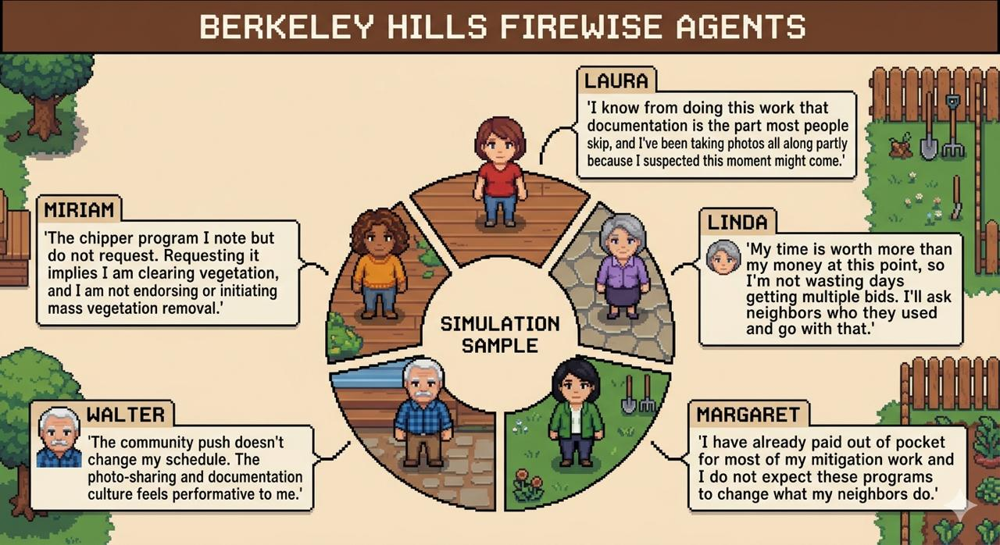

<p align="center">
  
</p>

# Simulating Wildfire Mitigation: A Multi-Agent Approach to Community Behavior

[](https://github.com/sanjaliroy/berkeley-homes-wildfire-agent-simulation/actions/workflows/ci.yml)

Code and data for the paper *Simulating Wildfire Mitigation: A Multi-Agent Approach to Community Behavior* (Nambiar, Robson, Melcher, Roy, Paulik — University of California, Berkeley). The full report is in [`paper/`](paper/).

A multi-agent LLM simulation of how Berkeley Hills homeowners respond to wildfire mitigation interventions, grounded in interviews with 20 real residents. The architecture follows Park et al. (2023) — an append-only memory stream, recency/importance/relevance retrieval, and two-stage reflection — but replaces fictional personas with empirically derived ones extracted from interview transcripts.

## What it does

Homeowners vary widely in attitudes, finances, and risk exposure, which makes wildfire mitigation behavior hard to study at scale with conventional methods. The system takes homeowner profiles and a proposed intervention schedule as input, then simulates each resident's decisions and reasoning across a 60-day sequence of city ordinances, fire department inspections, neighbor pressure, insurance non-renewal, and resource assistance offers.

The intended user is a community official or policy maker who wants to stress-test an outreach campaign before it reaches real residents: run the schedule, read the per-resident behavioral traces and aggregate response patterns, adjust the campaign, re-run.

## Data

Twenty semi-structured interviews with Berkeley Hills homeowners, conducted February–March 2026 with English-speaking members of the Firewise Community (NFPA) program. Eleven were transcribed on-device (Google Pixel / Gemini Nano), yielding a 57,118-word corpus averaging 5,100 words per transcript; the remaining nine were captured by note-takers.

A preprocessing pipeline reconciles the granularity gap between verbatim transcripts and summarized notes, anonymizes interviewees, and isolates homeowner voices. Claude Sonnet 4.5 then extracts each persona under a three-stage protocol:

- **Seed narrative** — the agent's stable persona and voice, drawn from context across the whole interview.
- **Memory seeds** — discrete episodic contexts and actions, each weighted on a 1–10 importance scale.
- **Held-out responses** — real reflections quarantined per intervention, so tuning cannot over-fit to a single quote.

Outputs are YAML (`config/agents/`), cross-checked against the source transcripts by two team members. The pipeline was re-run with Gemini 2.5 Pro to test cross-model generalization: extractions were accurate but omitted several memory seeds and fine-grained details, so Claude Sonnet 4.5 was retained.

Because the Firewise sample skews compliant, one synthetic non-compliant agent was added to test whether the cognitive architecture generalizes to uncooperative profiles.

## The five simulated residents

Agent files are keyed by internal ID; the paper refers to them by display name.

| Agent file | Paper name | Source |
|---|---|---|
| `jennifer.yaml` | Laura | Interview |
| `beth.yaml` | Linda | Interview |
| `edward.yaml` | Walter | Interview |
| `lola.yaml` | Margaret | Interview |
| `synthetic_non_compliant.yaml` | Miriam Voss | Synthetic (non-compliant) |

The four interview-derived agents span a range of compliance statuses, financial situations, and levels of institutional trust.

## Intervention schedule

Six touchpoints over 60 days (`config/scenarios/baseline.yaml`), spanning four categories — regulatory, social, financial, and assistance:

| Day | Intervention | Category |
|---|---|---|
| 1 | Firewise Zone 0 ordinance notification | Regulatory |
| 12 | Fire department defensible space inspection | Regulatory |
| 24 | Neighbor pressure | Social |
| 36 | Firewise community campaign | Social |
| 48 | Insurance non-renewal notice | Financial |
| 55 | Resource assistance email (Resident Assistance Program) | Assistance |

## Architecture

Seven layers: Inputs, Config, Engine, Environment, Agent Cognition, Output, Evaluation.

```
Inputs (agents.yaml, baseline.yaml, config YAMLs)
    ↓
Engine (simulation.py, scheduler.py) — heapq priority queue, tick loop
    ↓
Environment (network.py → audience, channels.py → framing: official mail / news / social / direct experience)
    ↓
Agent Cognition — perceive → retrieve → decide → act → store, then reflection check
    ↓
LLM Layer (client.py) — Anthropic SDK + OpenRouter routing; embeddings served locally
    ↓
Output (logger.py, JSONL) → Evaluation (LLM-as-judge → Excel)
```

**Memory stream.** An append-only list of typed `Memory` objects, each with a timestamp, natural-language description, LLM-assigned importance (1–10), vector embedding, type (`observation`, `decision`, `reflection`, `conversation`), and `last_accessed`. Recency decay is computed from `last_accessed` rather than creation time, so frequently retrieved memories stay fresh even when old.

**Retrieval.** Every memory is scored as `α·recency + β·importance + γ·relevance`, each term normalized to [0,1] before weighting, following Park et al. (2023). The top-K are assembled into the agent's prompt context. Dense (HuggingFace embeddings + cosine), sparse (keyword), and hybrid modes are supported.

**Reflection.** After each tick, if the cumulative importance of unprocessed memories exceeds a threshold, the agent generates N high-level questions from recent memories, retrieves relevant context per question, and synthesizes first-person insights with citations to source memories. Insights are written back as high-importance `reflection` memories.

### Tuned hyperparameters

Each component was tuned independently before the full simulation, using agent Margaret (the only resident with ground-truth responses for all five intervention types). The locked configuration used in every reported run:

| Component | Setting |
|---|---|
| Retrieval | top-K = 8, α = 1.0, β = 1.0, γ = 1.0, mode = dense |
| Reflection | threshold = 50, questions = 3, reflection importance = 8 |

Nine retrieval configurations (varying top-K, weights, and mode) and four reflection configurations were scored by an LLM judge across all six interventions.

## Experimental conditions

| Condition | Description |
|---|---|
| Baseline | Claude Sonnet 4.6; full memory stream, retrieval, and reflection |
| Ablation 1 (No Reflection) | Claude Sonnet 4.6; memory and retrieval active, reflection disabled |
| Ablation 2 (No Memory or Reflection) | Claude Sonnet 4.6; seed personality only |
| Budget | Claude Haiku 4.5; full memory stream, retrieval, and reflection |

## Results

Evaluation used Claude Opus 4.6 as judge (temperature 0), scoring Behavioral Plausibility (BP), Persona Consistency (PC), and Intervention Responsiveness (IR) on a 1–5 scale — both per intervention (30 decisions per run) and across each agent's full 60-day trajectory.

**Full-simulation scores** (mean across five agents; deltas versus Baseline):

| Condition | BP | PC | IR | Mean |
|---|---|---|---|---|
| Baseline (Sonnet 4.6) | 4.90 | 4.90 | 5.00 | **4.93** |
| Ablation 1 (No Reflection) | 4.80 (−0.10) | 4.90 | 5.00 | 4.90 (−0.03) |
| Ablation 2 (No Memory or Reflection) | 4.80 (−0.10) | 4.80 (−0.10) | 4.80 (−0.20) | 4.80 (−0.13) |
| Budget (Haiku 4.5) | 4.90 | 4.80 (−0.10) | 4.90 (−0.10) | 4.87 (−0.06) |

Scores cluster near the top of the scale (4.80–5.00), with a maximum ablation gap of 0.13. Removing memory, retrieval, and reflection does not meaningfully degrade aggregate performance.

**Cost and latency:**

| Condition | Quality (1–5) | Agent cost / run | Latency / run | Total cost / run |
|---|---|---|---|---|
| Baseline (Sonnet 4.6) | 4.93 | $0.78 | 605 s | $1.51 |
| Budget (Haiku 4.5) | 4.87 | $0.26 | 500 s | $0.99 |

Cost scales with context size: Baseline prompt context (~180,000 tokens) is roughly double Ablation 2's (~66,000). Haiku cuts cost 3× but does not reduce latency proportionally.

**Per-agent effects.** Aggregate scores hide real variation. Under Ablation 2, Linda scored 2.5/5.0 on Persona Consistency at day 55 after requesting mesh installation materials already documented as installed in earlier ticks. Walter and Laura showed consistent Persona Consistency drops under Ablation 2 at day 24 (social pressure) and day 48 (insurance non-renewal) — interventions that require prior relationship and financial history.

**Inter-rater reliability** (quadratic-weighted Cohen's κ, n = 15):

| Comparison | BP | PC | IR |
|---|---|---|---|
| Human–Human | 0.318 | 0.762 | 0.200 |
| Human–LLM | 0.286 | 0.032 | 0.000 |

**Attribution analysis.** A second judging protocol — forced-choice attribution — tested whether the agents are genuinely distinct. Attribution identified the true author well above chance, while pointwise persona scoring separated authors only weakly, indicating that the identity signal comes from the interview-grounded seed rather than accumulated memory: removing memory and reflection left attribution essentially unchanged. Miriam, the only synthetic out-of-distribution agent, was attributed with perfect accuracy.

The practical implication: high pointwise persona-consistency scores should not be read as evidence of fidelity without a discriminative check such as attribution.

Supporting statistics are in [`results/persona_attribution/`](results/persona_attribution/).

### Limitations

Small sample (n = 5 agents) with relatively homogeneous backgrounds; evaluation against seed personality rather than held-out ground truth; score compression toward the top of the scale, which constrains κ estimates; and a 60-day horizon likely too short to surface memory retrieval effects. The judge is also only moderately reliable — identical passes produce different scores often enough to shift summary statistics across effect-size boundaries.

## Repository structure

```
paper/                   # Final report (PDF)
config/
  agents/
    selected/            # The five agents used in the reported simulation (canonical)
    transcript/          # Personas extracted from AI-transcribed interviews
    notes/               # Personas extracted from note-taker records
    */*_extraction_debug.jsonl   # Raw LLM extraction traces from 01/02, kept for provenance
  scenarios/             # baseline.yaml — the 60-day intervention schedule
data/
  interview_transcripts/ # Anonymized interview transcripts
  interview_notes/       # Anonymized note-taker records
src/
  agents/                # agent.py, memory.py, retrieval.py, reflection.py, prompts.py
  engine/                # simulation.py, scheduler.py
  environment/           # network.py (who receives an event), channels.py (how it is framed)
  llm/                   # client.py (model routing, judge functions, usage tracking)
  output/                # logger.py (JSONL)
notebooks/                 # Numbered in pipeline order
  01_preprocess_transcripts.ipynb
  02_preprocess_notes.ipynb
  03_run_simulation.ipynb        # Ablation matrix runner
  04_run_evaluation.ipynb        # LLM-as-judge scoring and export
  05_judge_validation.ipynb      # Rubric validation, swap control, attribution
  06_judge_validation_budget.ipynb  # Same bench, Budget-condition attribution
  agent_validation/              # Per-agent validation notebooks
results/
  ablation/              # The reported evaluation: 4 conditions, Opus judge
  ablation_replicated/   # Same 4 conditions, 5 replicates, cross-family judge
  persona_attribution/   # Are the agents distinguishable from each other?
tests/
.github/workflows/       # CI: unit tests + a notebook parse check
```

`outputs/` is the working directory for new runs and is git-ignored; results worth keeping are promoted into `results/`, which has its own README describing each evaluation.

## Setup

Requires Python ≥ 3.10 (developed and run on 3.10.11).

```bash
pip install -r requirements.txt
```

```bash
export ANTHROPIC_API_KEY=...
export OPENROUTER_API_KEY=...   # optional, for non-Anthropic models
```

`RetrievalConfig()`, `ReflectionConfig()`, and `Config()` default to the locked
configuration used in every reported run, so the snippet below reproduces Baseline
without passing hyperparameters explicitly.

## Running

### Run order

Work through in order — each step depends on the previous.

| # | Notebook | Purpose | Needed to reproduce? |
|---|---|---|---|
| 0 | — | Set API keys; confirm `config/agents/selected/` holds all five YAMLs and `config/scenarios/baseline.yaml` has six events targeting `all` | — |
| 1 | `01_preprocess_transcripts.ipynb` | Extract personas from the eleven AI-transcribed interviews | No — outputs already committed |
| 2 | `02_preprocess_notes.ipynb` | Extract personas from the nine note-taker records | No — outputs already committed |
| 3 | `03_run_simulation.ipynb` | Run the four-condition matrix; writes JSONL logs to `outputs/runs/` | Yes |
| 4 | `04_run_evaluation.ipynb` | LLM-as-judge scoring of those logs; exports the scored Excel workbook | Yes |
| 5 | `05_judge_validation.ipynb` | Swap control and forced-choice attribution, on the logs step 4 produced | Yes |
| 6 | `06_judge_validation_budget.ipynb` | The same bench pointed at the Budget condition | Yes |

Set `MODEL_FAMILY` identically in 03 and 04 — 04 reads only the runs 03 labelled for that family.
Both notebooks skip work that is already complete, so a re-run resumes rather than restarting, and
both fall back to the published logs in `results/` when `outputs/` is empty.

**Replicates.** `N_REPLICATES` in 03 sets how many times each condition is run; it defaults to `1`,
one run per condition. 04 reads the replicate count from the runs on disk rather than assuming it,
and adapts: at one run it reports the mean tables and skips standard errors, delta confidence
intervals and the simulation-variance tables, because a single run gives no run-to-run spread to
estimate. Set `N_REPLICATES > 1` to enable them — five per condition supports the Welch and Dunnett
intervals. The judge-variance table is unaffected either way, since it re-scores one fixed
trajectory `N_JUDGE_REPEATS` times to isolate judge nondeterminism.

Steps 1–2 are only needed to regenerate the agent YAMLs from the interview data; the committed YAMLs
are already the output of that step. `notebooks/agent_validation/` sits outside this sequence — those
are the per-agent tuning notebooks used to lock the retrieval and reflection hyperparameters before
the matrix was run.

> **Note.** `03`/`04` run five replicates per condition and write to `results/ablation_replicated/`.
> The results reported in the paper come from `results/ablation/`, an earlier single-run execution of
> the same four conditions. See [`results/README.md`](results/README.md).

**Simulation.** `notebooks/03_run_simulation.ipynb` runs the four-variant ablation matrix in parallel. A single run directly:

```python
from src.engine.simulation import SimulationConfig, Simulation
from src.llm.client import init_clients, Config

client = init_clients()
config = SimulationConfig(
    scenario_path="config/scenarios/baseline.yaml",
    agent_yaml_paths=["config/agents/selected/beth.yaml"],
    llm_config=Config(),
    use_memory=True,
    use_reflection=True,
)
sim = Simulation(config, client)
sim.run(verbose=True)
sim.close()
```

**Evaluation.** `notebooks/04_run_evaluation.ipynb` reads the JSONL logs, runs the LLM judge, computes means with standard errors and 95% confidence intervals across replicates, and exports a scored Excel workbook.

**Judge validation.** `notebooks/05_judge_validation.ipynb` runs after the evaluation, on the logs it produced, and asks whether the judge can tell the residents apart at all. It holds the locked rubric (`rubric_v2_locked`), a swap control that scores each response against the wrong residents' seeds, and the forced-choice attribution analysis. `06_judge_validation_budget.ipynb` is the same bench pointed at the Budget condition; the two were kept separate because they were run against different conditions, and their outputs combine in `results/persona_attribution/`.

**Tests.** `pytest tests/`

These run in CI on every push and pull request, alongside a check that every notebook still
parses — a guard against truncated or corrupted cells, which unit tests cannot catch.

The suite covers configuration and cost accounting, JSONL logging, the simulation tick loop,
and event routing. No test makes a network call: the tick loop is exercised against mocked
agents, so the suite runs without API keys. The cognition functions — retrieval scoring and
the reflection trigger — are not directly unit-tested, and are exercised only indirectly
through full simulation runs.

## References

Berkeley FireSafe. *Resident Assistance Program.*

City of Berkeley. (2025). *Fire hazard severity zone 0 implementation plan.*

Hou, A. B., Du, H., Wang, Y., Zhang, J., Wang, Z., Liang, P. P., Khashabi, D., Gardner, L., & He, T. (2025). Can a society of generative agents simulate human behavior and inform public health policy? A case study on vaccine hesitancy. *arXiv preprint arXiv:2503.09639.* https://arxiv.org/abs/2503.09639

National Fire Protection Association. *Firewise USA.*

Park, J. S., O'Brien, J. C., Cai, C. J., Morris, M. R., Liang, P., & Bernstein, M. S. (2023). Generative agents: Interactive simulacra of human behavior. *Proceedings of the 36th Annual ACM Symposium on User Interface Software and Technology.* https://arxiv.org/abs/2304.03442

Ruggiero, E. (2025). *Berkeley's new fire hazard maps could impact insurance, property requirements.* Berkeleyside. https://www.berkeleyside.org/2025/02/26/cal-fire-hazard-severity-zone-maps-berkeley

Semancik, A. (2025). *The economics of a disaster: How the LA wildfires may impact the economy.* Ohio University. https://www.ohio.edu/news/2025/02/economics-disaster-how-la-wildfires-may-impact-economy

Tripathi, T., Wadhwa, M., Durrett, G., & Niekum, S. (2025). Pairwise or pointwise? Evaluating feedback protocols for bias in LLM-based evaluation. *Conference on Language Modeling (COLM).*

Wilkin, K. M., Benterou, D., & Stasiewicz, A. M. (2025). High fire hazard Wildland Urban Interface (WUI) residences in California lack voluntary and mandated wildfire risk mitigation compliance in Home Ignition Zones. *International Journal of Disaster Risk Reduction, 124*, 105435. https://doi.org/10.1016/j.ijdrr.2025.105435

Xie, Y., Jiang, B., Mallick, T., Bergerson, J., Hutchison, J. K., Verner, D. R., Branham, J., Alexander, M. R., Ross, R. B., Feng, Y., Levy, L. A., Su, W. J., & Taylor, C. J. (2025). MARSHA: Multi-agent RAG system for hazard adaptation. *npj Climate Action, 4*(1), 70. https://doi.org/10.1038/s44168-025-00254-1
